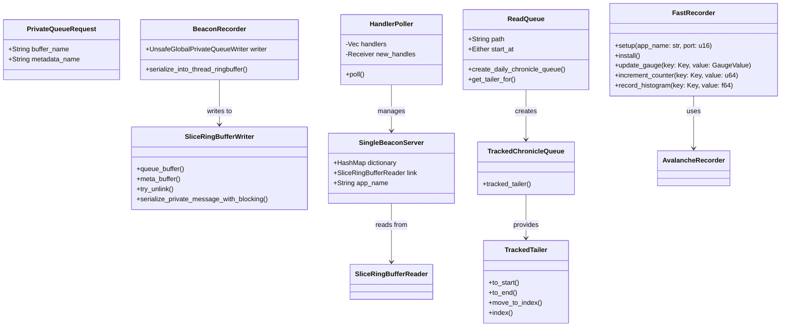
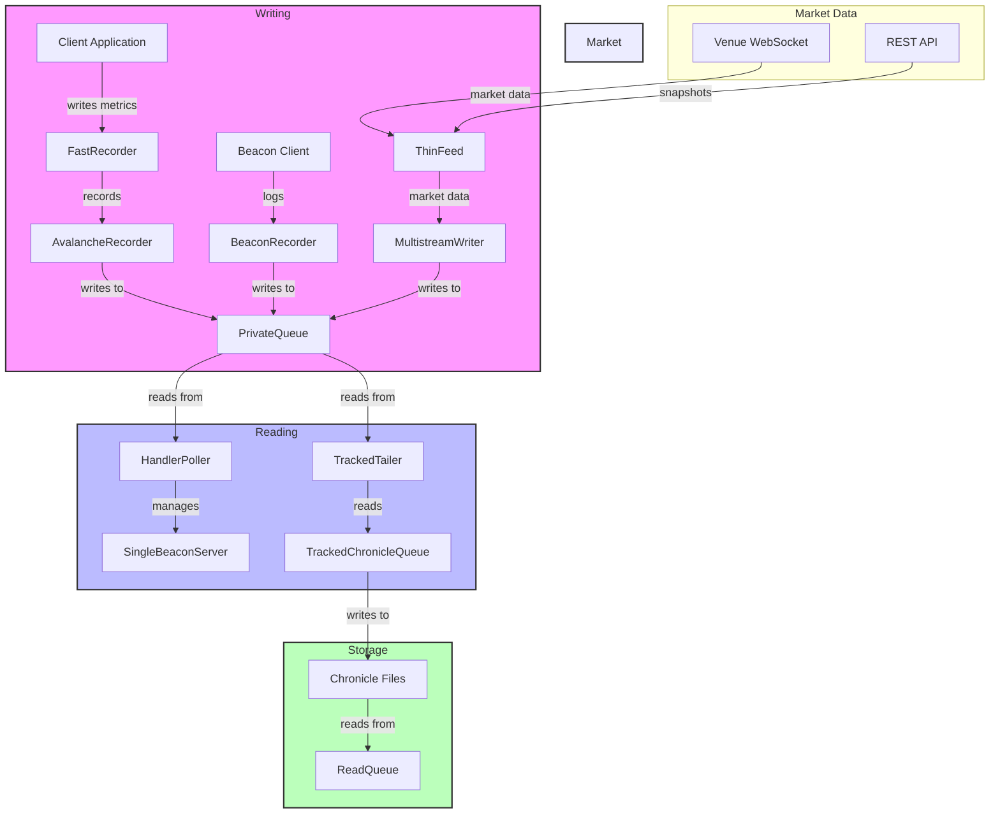

- Make thinfeed resilient to not having access to avalanche
	- "works", but will currently block. It needs to be nonblocking. MD stops getting pushed if avalanche writer is not accessible
- Make thinfeed resilient to not having access to the chronicle stuffer
	- Spin up a new thread that will often retry to connect
	- If the reader disappears, stream is dirty
	- If the stream is dirty, need to figure out a snapshot push
	- Eventually, snapshots shouldn't be managed by the MD feeds
- ~~Figure out how shared memory will work with /dev/shm~~
- Poisonpill management
	- Modify the existing one so that MD does not killself when receiving pill from main app
	- The pill that MD sends should propagate to the other app
- ~~Shared memory ensure it will work well in docker~~

```
thread 'main' panicked at src/fair_value/bin/fair_publisher.rs:172:5:
Exited loop with error: Eventer actor of type fair_value::events::l3_bookbuilder::L3BookBuilder on message type fair_value::events::TaggedL3 failed to handle message

Caused by:
    L3 bookbuilder got non-snapshot message before receiving snapshots on PENGU_USDT_bybit_spot: CompressedBookEvents { bid_events: [], ask_events: [CompressedBookEvent { price: 439, level_event: Cancel(189000) }], unhandled_trades: [], exchange_timestamp: CompressedTimestamp { seconds_lower32: 1744368316, seconds_upper32: 0, ns: Ms(136) }, price_compressor_index: 20, size_compressor_index: 30 }
note: run with `RUST_BACKTRACE=1` environment variable to display a backtrace
```

### Shared memory
#### Two containers side by side, without sharing anything (other than --network=host)
```
Caused by:
    No such file or directory (os error 2)    
2025-04-09T14:18:21.773595Z  INFO ThreadId(02) private_queue::server: Private queue server got request: Request(POST /private_queue from Some(127.0.0.1:51256))    
2025-04-09T14:18:21.773726Z ERROR ThreadId(02) private_queue::server: Failed to load private queue from req PrivateQueueRequest { buffer_name: "private_queue_thin_feed_binance_0_79_5913417630641059392_2", metadata_name: "private_queue_thin_feed_binance_0_79_10412941593865136482_3" }: Failed to open file at private_queue_thin_feed_binance_0_79_10412941593865136482_3

Caused by:
    No such file or directory (os error 2)    

```
#### Two containers side by side with --ipc=host
![[Pasted image 20250409154650.png]]

#### Two containers each mounting /dev/shm
![[Pasted image 20250409155311.png]]




